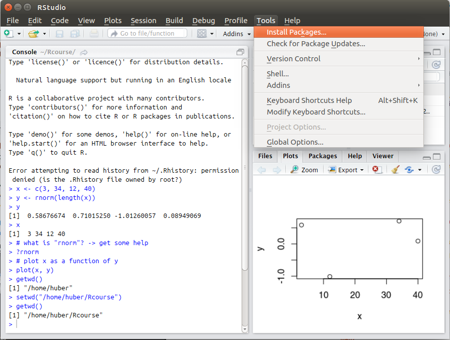
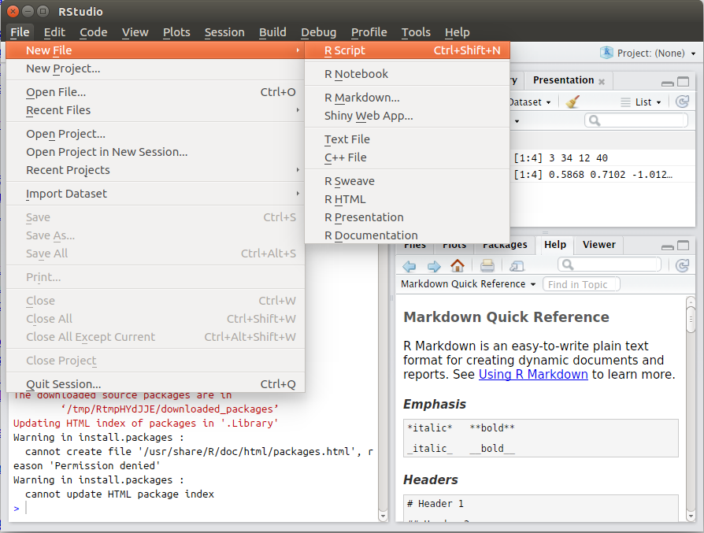

<!--

  Hey there! This page is included as an example. Feel free to customize it for your own use upon downloading. Carry on!

-->

## RStudio environment

## History

## Help

## Plot

## Get working directory `getwd()`

## Set working directory `setwd()`

## Install package

## Create a script file

## Run the code

