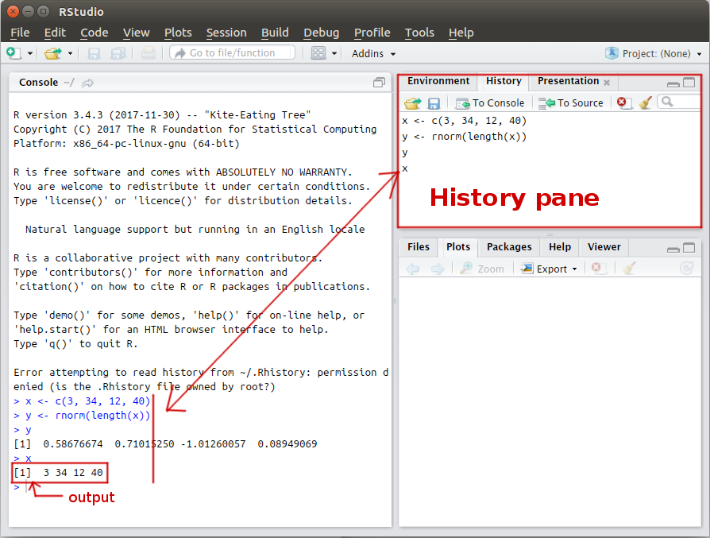
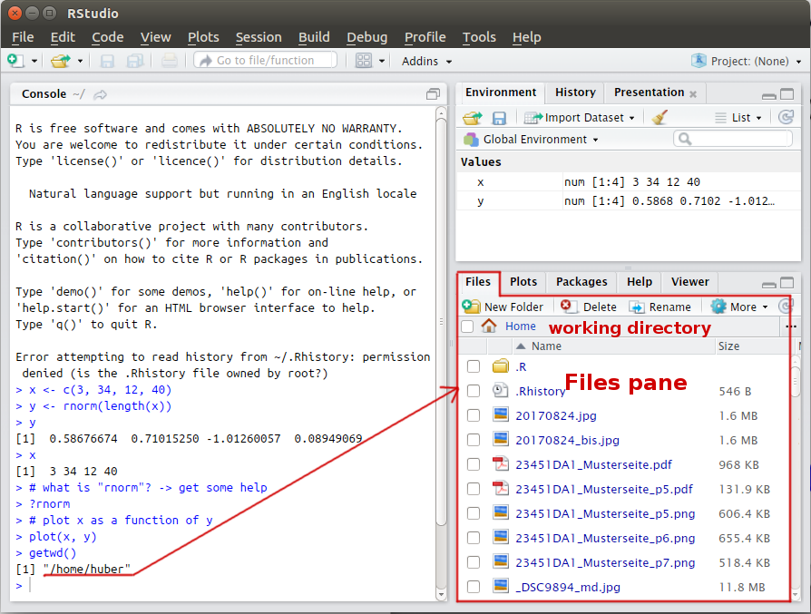

<!--

  Hey there! This page is included as an example. Feel free to customize it for your own use upon downloading. Carry on!

-->

**Objective:** learn to use RStudio, a free and open-source integrated development environment (IDE) for R.

Check the [RStudio IDE cheat sheet](https://www.rstudio.com/wp-content/uploads/2016/01/rstudio-IDE-cheatsheet.pdf)

## RStudio environment

## History

## Help

## Plot

## Get working directory `getwd()`

## Set working directory `setwd()`

## Install package

## Create a script file

## Run the code

