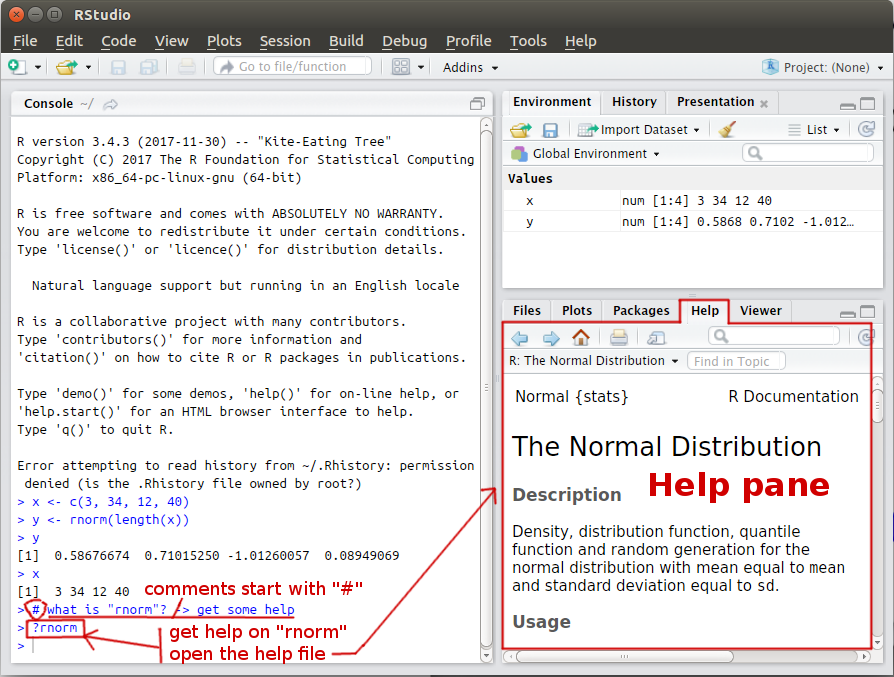

<!--<p class="message">
  Hey there! This page is included as an example. Feel free to customize it for your own use upon downloading. Carry on!
</p>-->


<p class="message">
<strong>Objective:</strong> learn to use RStudio, a free and open-source integrated development environment (IDE) for R.
</p>


Check the [RStudio IDE cheat sheet](https://www.rstudio.com/wp-content/uploads/2016/01/rstudio-IDE-cheatsheet.pdf)


## RStudio environment

### Console

Type for example
```r
x <- c(3, 34, 12 40)
```
in the console then press enter. You should got this result.


To print the content of the variable `x`, type in the console
```r
x
```
then press enter.

### History


### Help



### Plot


## Setting your working directory

To see what is your current working directory, type in the console
```r
getwd()    # get working directory
```
then press enter.


To set another working directory, type in the console
```r
setwd("YOUR_DIRECTORY")    # set working directory
```
then press enter. The variable `"YOUR_DIRECTORY"` is either:

* a relative path (e.g., `setwd("mysubfolder/run")`)
* or an absolute path (e.g., `setwd("C:/RCourse/mysubfolder/run")`).

**WARNING** You need to use the forward slash `/` as it is on Linux or Mac system. 
Alternatively, you can use the function `file.path` to correctly construct/assemble the file path:
```r
setwd(file.path("C:", "RCourse", "mysubfolder", "run"))
```

Then check if the path has been correctly set by typing `getwd()` in the console.
Notice that the files panel on the right changed!


You can also set the working directory through the menu interface of RStudio (see below):


## Install package

R packages are collections of functions and data sets. The official R repository for package is the
[Comprehensive R Archive Network](https://cran.r-project.org/) (check the link "Packages", about 12133 available packages).

Packages can be installed by typing in the console
```r
install.packages(c("RConics", "plot3D"))
```
where `c("RConics", "plot3D")` is the vector of packages you want to install.


Alternatively, you can install a package through the menu interface of RStudio (see below):


Once a package is installed, you need to load it in your current session to use it.
Load the packages `RConics` and `plot3D` with the function `library()`:
```r
library("RConics")
library("plot3D")
```

## Create a script file


## Run the code
* Either use the "run" button:
    

* or select the code to run and press `[Ctrl] + [Enter]`:
    


