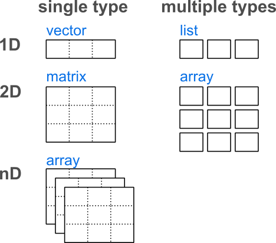

# R packages

## Package documentation
Here example of a package documentation page: `https://cran.r-project.org/web/packages/sp/index.html`


## Package - Reference manual


## Package - Reference vignette


## Package - Package source


## Package - Install packages hosted on CRAN


## Package - Install packages hosted on github 

```r 
if(!require("devtools")) install.packages("devtools")
devtools::install_github("emanuelhuber/RGPR")
```

# Help!

## Getting help
* get help on the function `plot()`: 
    ```r
    help(plot)
    ```
    or 
    ```r
    ?plot
    ```
* get help on general terms
    ```r
    ??regression
    ```
* ?? `library(help = "base")`
See [getting help with R](https://www.r-project.org/help.html)
* Google: "**R Cran** how to extract rows data.frame"

# R language

## R language
[Official documentation](https://cran.r-project.org/doc/manuals/r-devel/R-lang.html)

### Main differences to MATLAB

* `x <- x + 10` instead of `x = x + 10`
* Matrices A: `A[1, 3]` instead of `A(1, 3)`
* comments with `#` instead of `%`
* no need for `;`
* R is more structured: use `{` in the loop
    ```r
    for(i in 1:10){
      # my code here
    }
    ```
[Matlab - R](https://cran-r.c3sl.ufpr.br/doc/contrib/Hiebeler-matlabR.pdf)

### Exotic stuff
**Namespace**

<!--  For example, the intersect function is available in the base, spatstat and raster packages–all of which are loaded in this current session. To ensure that the proper function is selected, it’s a good idea to preface the function name with the package name as in raster::intersect(). -->

`packageName::functionName()`

**Pipe `%>%`**

```r
third(second(first(x)))
first(x) %>% second %>% third
```
[source](https://bookdown.org/rdpeng/exdata/managing-data-frames-with-the-dplyr-package.html#section)

**Ellipsis `...`**
fun <- function(x, ...){
  plot(x, ...)
}


## Basic object types

`type.of()`???

* numeric: `e24`, `-150.5`, `pi`
    `is.numeric()`
* integer: `1L`, `-54L`, `0L`
    `is.integer()`
* complex: ???
    `is.complex()`
* character: "AUG", "13.12", "www.google.ch"
    `is.character()`
* boolean (logical): `TRUE`, `FASLE`
    `is.logical()`
* `NA`, `Inf`, `NULL`     
    
[check](https://swcarpentry.github.io/r-novice-inflammation/13-supp-data-structures/)

## Object classes
{width=45%}


* numeric, matrix, list, data.frame
* S3 classes: example regression
* S4 classes [tutorial](http://mazamascience.com/Classes/IRIS_2015/Lesson_06_WorkingWithSeismicTraces.html)
    * date and time 
        [good tutorial](http://biostat.mc.vanderbilt.edu/wiki/pub/Main/ColeBeck/datestimes.pdf)
    * spatial data raster/sf

## Functions to understand your data
* `str()`
* `class()`
* `unclass()`
* `typeof()`
* `names()` `colnames()`, `rownames()`
* `dim()`, `length()`
* S4: `isS4()`, `getSlots()`, `slotNames()`
* attributes()

`methods(class = "sf")`

show example from ?approx


## Conversion

### Basic object types

- `as.character()`
- `as.integer()`
- `as.numeric()`
- `as.logical()`
- `as.complex()`
- `as.matrix()`
- `as.data.frame()`
- `as.list()`

conversion class `sf` to `sp`: as(x, "Spatial")

<!--
- R language
    - Most important:
        - help() and '?' str() typeof() class()
        - google: "R Cran plot surface 3D", 
                  "how to extract rows and columns of a data frame"
    - document R to Matlab!
    - Basic object types
        - data.frame
        - date and time
        - spatial data
    - S3 and S4 classes
    - source()
    - plot functions
        - plot3D
    - read/write


   
- Output
    - save figures
    - save data -> txt, rds
    
-->