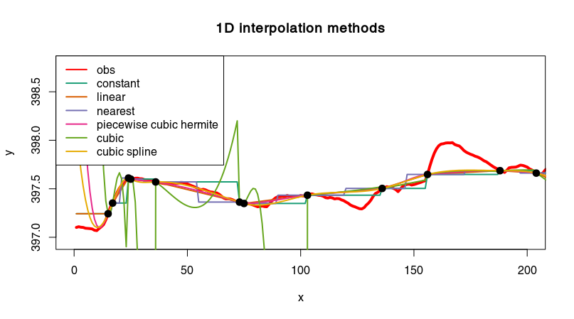
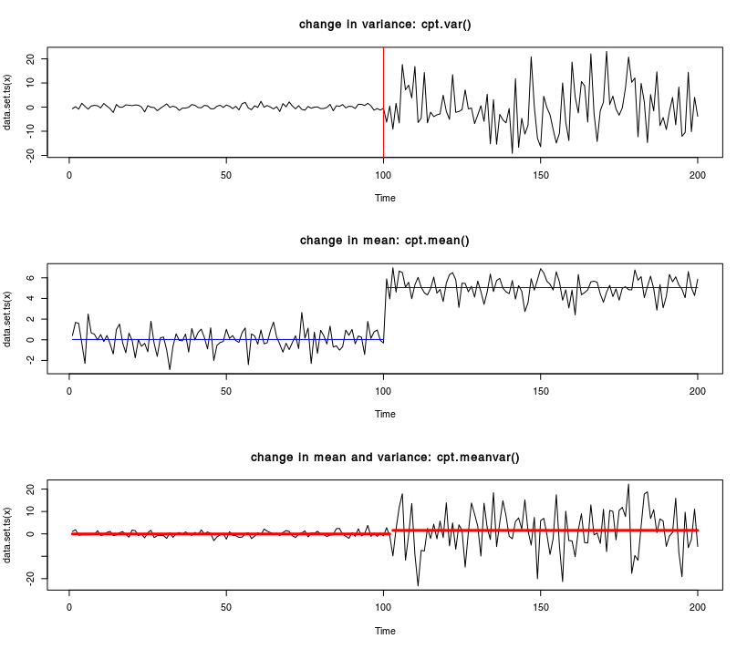
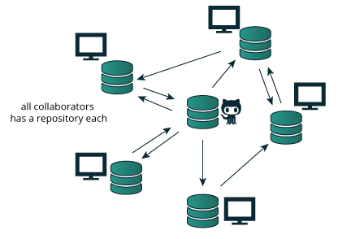

```{r setup, include=FALSE}
knitr::opts_chunk$set(echo = FALSE, size = 'tiny')
```

<!--
\columnsbegin
\column{.6\textwidth}
\column{.4\textwidth} 
\columnsend
-->

## Outline

* Talk 1:
    1. Overview of R 
    2. potential use for AUG-group
* Talk 2: Some important concept on R language

### Resources
- for each task (on [https://emanuelhuber.github.io/Rcourse/](https://emanuelhuber.github.io/Rcourse/)
    - list of best R-package
    - cheat sheets
    - online book/course/tutorial
- some tutorial on P:/RKurs (including data)


# Introduction

## Programming language ranking by the IEEE (2017)
[Institute of Electrical and Electronics Engineers ranking](https://spectrum.ieee.org/computing/software/the-2017-top-programming-languages)

{ width=100% }

## Why R is so popular

* free and open-source (no licence)
* runs on Linux, Windows and MacOS.
* large community
* many packages available that are documented (help files + vignette)
* can link C, C++, Fortran code
* excellent tools for data analysis (Google, Airbnb, Facebook, Microsoft...)
* high-quality graphics
* object-oriented programming

## R Environment: GUI and packages


\columnsbegin
\column{.5\textwidth}

\column{.5\textwidth} 
**More than 12'000 packages!**

\columnsend


# Potential use of R for AUG group

## R strengths

\columnsbegin

\column{.6\textwidth}


\column{.4\textwidth}

* all-in-one tool
* no licence 
* teaching, research, reporting
* automation and reproducible workflow
 
\columnsend
 


# Data import/export

## Resources - data import

\scriptsize

| Function      	   | What It Does	                                          |
|--------------------|---------------------------------------------------------|
| `read.table()`	   | Reads any tabular data where the columns are separated |
|                    | `read.table(file = "filePath", sep = "\t", header = TRUE)` |
| `read.csv()`	     | A simplified version of read.table() to read CSV files.	| 
|                    | `read.csv(file = "filePath")` |
| `scan()`        	 | Finer control over the read process when your data isn’t tabular.	|
|                    | `scan("filePath", skip = 1, nmax = 100)` |
| `readLines()`   	 | Reads text from a text file one line at a time.	|
|                    | `readLines("filePath")` |
| `read.fwf()`	     | Read a file with dates in fixed-width format.	| 
|                    |`read.fwf("filePath", widths = c(1, 2, 3)` |
|`readxl::read_excel()` | To read excel files (xls and xlsx), from [`readxl`](https://cran.r-project.org/web/packages/readxl/index.html) package |
|                    | `read_excel("filePath", sheet = "mtcars")`|

## Import/export


# Data preparation

## Resources - data cleaning

* **Package**
    - [`dplyr`](https://cran.r-project.org/web/packages/dplyr/index.html)
* **Cheat sheet**
    - [regular expression cheat sheet](https://www.rstudio.com/wp-content/uploads/2016/09/RegExCheatsheet.pdf)
    - [`dplyr`: data transformation cheat sheet](https://github.com/rstudio/cheatsheets/raw/master/data-transformation.pdf)
* **Tutorials/book**
    - [Tutorial: An introduction to data cleaning with R (53 p.)](https://cran.r-project.org/doc/contrib/de_Jonge+van_der_Loo-Introduction_to_data_cleaning_with_R.pdf)
    - [Hands-On Data Science with R: Data Preparation](https://onepager.togaware.com/DataO.pdf)
    - [check `dplyr`-vignettes](https://cran.r-project.org/web/packages/dplyr/index.html)
    - [Tutorial: Regular Expressions in R](https://rstudio-pubs-static.s3.amazonaws.com/74603_76cd14d5983f47408fdf0b323550b846.html)


## Data cleaning (1)

\columnsbegin

\column{.6\textwidth}


* rename variables: `Head`, `RIV_head`, `324/head`, `head`, `HEAD` -> `head`
    ```{r size = 'tiny', eval = FALSE, echo = TRUE}
    pattern <- "^RIV_|^[[:digit:]]+/"
    x$parameter <- sub(pattern, "", x$parameter)
    x$parameter <- tolower(x$parameter)
    ```

\column{.4\textwidth}

* remove rows/columns
* remove duplicates
* transform data
* correct for inconsistencies
* convert data type
* deal with missing values

\columnsend

<!--
* remove rows/columns
* remove duplicates
* transform data (e.g., unit conversion: bar in meter)
* correct for inconsistencies (e.g., negative temperature)
* convert data type (character/numeric into date/factor)
* deal with missing values (-`, `unbekannt`, `-999` into `r NA`)

-->
    
## Data cleaning (2)

\columnsbegin
\column{.7\textwidth}

\column{.3\textwidth} 
**detect typo errors**
- distance between strings
- dendrogram visualisation
- partial string matching
\columnsend


## Resources - data shaping
* **Package**
    - [`tidyr`](https://cran.r-project.org/web/packages/tidyr/index.html)
* **Cheat sheet**
    - [`tidyr`: Tidy Data (see p. 2)](https://github.com/rstudio/cheatsheets/raw/master/data-import.pdf)
* **Tutorials/book**
    - Concepts of data tidying are well explained in the chapter [Data Tidying](http://garrettgman.github.io/tidying/) from the book Data science with R.


## Data shaping 1 (tidy data)
\columnsbegin
\column{.45\textwidth}
"Messy" data

\column{.45\textwidth} 
Tidy data satisfies three rules ([see Data Science with R](http://garrettgman.github.io/tidying/)):

 * Each variable in the data set is placed in its own column
 * Each observation is placed in its own row
 * Each value is placed in its own cell
 
\columnsend

Tidy data

{ width=70% }
 
```r
x_tidy <- tidyr::spread(x, parameter, value)
```

reverse process possible


# Data analysis and processing


## Data analysis
* data analysis
    - statistics: [check](https://www.hydrology.uni-kiel.de/de/mitarbeiter/Statistics)
    - linear regression
    - [boxplot](https://cran.r-project.org/web/packages/beanplot/vignettes/beanplot.pdf)
    - linear regression (p-value, R^2)
    - PCA (linear relationship)
    - [cluster analysis](http://www.sthda.com/english/articles/25-cluster-analysis-in-r-practical-guide/111-types-of-clustering-methods-overview-and-quick-start-r-code/)
         - dendrogram [nice tutorial](http://www.sthda.com/english/wiki/beautiful-dendrogram-visualizations-in-r-5-must-known-methods-unsupervised-machine-learning), [another tutorial](https://rpubs.com/gaston/dendrograms)
         - k-means algorithm


## Sensitivity analysis 
         

## Time series - resources

* **Package**
    - "eXtensible Time Series" [`xts`](https://cran.r-project.org/web/packages/xts/index.html) that extends the [`zoo`](https://cran.r-project.org/web/packages/zoo/index.html) package
    - [`zoo`](https://cran.r-project.org/web/packages/zoo/index.html) for regular and irregular Time Series
    - [`lubridate`](https://cran.r-project.org/web/packages/lubridate/index.html) to deal with date and time
* **Cheat sheet**
    - [eXtensible Time Series: `xts`](https://s3.amazonaws.com/assets.datacamp.com/blog_assets/xts_Cheat_Sheet_R.pdf)
    - [How to deal with date and time: `lubridate` cheat sheet](https://github.com/rstudio/cheatsheets/raw/master/lubridate.pdf)
* **Tutorials/book**
    - [check `xts` vignettes](https://cran.r-project.org/web/packages/xts/index.html)
    - [check `zoo` vignettes](https://cran.r-project.org/web/packages/zoo/index.html) 
    - [Dates and Times Made Easy with `lubridate`](http://vita.had.co.nz/papers/lubridate.pdf)

Check package for time-series processing:

* pracma 
* signal

<!--
- [Tutorial for Introductory Analysis of
Daily Precipitation Data with hydroTSM](https://cran.r-project.org/web/packages/hydroTSM/vignettes/hydroTSM_Vignette-knitr.pdf)
- [Tutorial: Time series analysis in R](http://www.css.cornell.edu/faculty/dgr2/teach/R/R_ts.pdf)

Bof:
- [Packages for Getting started with time-series analysis in R](https://www.r-bloggers.com/packages-for-getting-started-with-time-series-analysis-in-r/)


Can lubbridate handle summer time and winter time ?
-->

## Time series - Import and preparation

* Import function (?)
* Detect and remove anomalies in time-series
    Application: remove anomalies and estimate true values
    
    [source](https://github.com/twitter/AnomalyDetection)
* fill in missing values (interpolation)
* regular time-step
    - smoothing
    - decimate


## Time series - Dynamic visualisation

Dynamic time series visualisation with package [`dygraph`](https://cran.r-project.org/web/packages/dygraph/index.html)


## Time series - Visualisation

merci MM!

Import of groundwater head data from FEFLOW 

`P:/RKurs/...`


## Time series - Simulated vs observed

\columnsbegin
\column{.5\textwidth}

\column{.5\textwidth} 

\columnsend


## Time series - Goodness-of-fit


## Time series - Residual visualisation *à la GMS*

\columnsbegin
\column{.4\textwidth}

\column{.6\textwidth} 

\columnsend

## Time series - Clustering 

\columnsbegin
\column{.7\textwidth}

{ width=90% }

{ width=80% }
\column{.3\textwidth}

* remove obs with too many `NA`'s
* interpolate missing data `NA`
* compute distances between obs
* cut dendrogram --> classes
* plot onto map


\columnsend

## Time series - statistics 
* Daily, monthly, yearly values (cf. book: Analysis of ecological data with R)
* Auto-correlation function (ACF) and Cross-correlation function (CCF)
    See ARIMA model [tutorial](https://www.analyticsvidhya.com/blog/2015/12/complete-tutorial-time-series-modeling/), [tutorial2](http://a-little-book-of-r-for-time-series.readthedocs.io/en/latest/src/timeseries.html)
* empirical cumulative distribution function

## Time series - spectral analysis 
* Fourier
* SSA
* ?
* wavelet analysis

## Time series - impulse response function 
Check RRAWFLOW package 
[rrawflow website](https://sd.water.usgs.gov/projects/RRAWFLOW/RRAWFLOW.html)

## Time series - Interpolation

{height=35%}

{height=35%}

## Time series - regression

* Regression

## Time series - Trend and seasonal components
\columnsbegin
\column{.5\textwidth}

\column{.5\textwidth} 

\columnsend

```r
x_dcp_add <- decompose(x, "additive")
x_dcp_mul <- decompose(x, "multiplicative")
```
[online tutorial](https://anomaly.io/seasonal-trend-decomposition-in-r/)

## Time series - mining and clustering

[Time series mining and clustering](https://rdatamining.wordpress.com/2011/08/23/time-series-analysis-and-mining-with-r/)

* Compute distance between time-series 
* Clustering
* Vizualisation (e.g., MDS)


## Time series - change detection


package [`changepoint`](https://cran.r-project.org/web/packages/changepoint)

- Example: NF-Fisch
    Plot CP1 against CP2 and CP3: ellipses
- CD-Experiment
- Gaussian process (`GauProMod`)
- [time-series cleanup](https://cran.r-project.org/web/packages/waterData/vignettes/vignette.pdf)
- [time-series](http://www.css.cornell.edu/faculty/dgr2/teach/R/R_ts.pdf)


## R GIS - resources

[R is a GIS software](ftp://ftp.bgc-jena.mpg.de/pub/outgoing/mforkel/Rcourse/spatialR_2015.pdf) (sp, rgeos, raster, rgdal) see also `sf` : [chjeck](https://cran.r-project.org/web/packages/sf/vignettes/sf1.html)

* **Package**
    - [`sf`](https://cran.r-project.org/web/packages/sf/index.html) package for spatial vector data. Binds to GDAL for reading and writing data, to GEOS for geometrical operations, and to Proj.4 for projection conversions and datum (*will remplace sp/rgeos/rgdal in the long term* [link](https://github.com/r-spatial/sf/wiki/migrating))
    - [`raster`](https://cran.r-project.org/web/packages/raster/index.html) package for raster, multi-band raster, ...
    - [lidR](https://github.com/Jean-Romain/lidR) for airborne LiDAR data manipulation and visualization for forestry application
    - packages to interact with existing GIS software [link](http://jwhollister.com/r_landscape_tutorial/tutorial.html)
        - `spgrass6`: Provides an interface between R and GRASS 6+. Allows for running R from within GRASS as well as running GRASS from within R.
        - `rgrass7`: Same as spgrass6, but for the latest version of GRASS, GRASS 7.
        - `RPyGeo`: A wrapper for accessing ArcGIS from R. Utilizes intermediate python scripts to fire up ArcGIS. Hasn’t been updated in some time.
        - `RSAGA`: R interface to the command line version of SAGA GIS.
* **Cheat sheet**
    - nothing...
* **Tutorials/book**
    - [Book: geocomputation with R](https://bookdown.org/robinlovelace/geocompr)
    - [Spatial Data Analysis and Modeling with R](http://rspatial.org/intr/index.html)
    
## R GIS 

\columnsbegin

\column{.4\textwidth} 


\column{.6\textwidth}

**Tool**

- manipulation raster
- manipulation feature 
- raster interpolation:
    - book: R_Applied Spatial Data Analysis with R.pdf (chap. 8, 8.11)

**Still missing**

- TIN
- watershed but 
    - check [that](https://gis.stackexchange.com/questions/182120/get-rivers-from-a-dem-raster)
    - check [how to compute flow accumulation](https://gis.stackexchange.com/questions/84309/what-algorithm-is-used-by-arcgis-watershed-tool)
    - idea: use local structure tensor to compute direction and accumulation....


- download tiles webgis of Italy region

\columnsend

## R GIS - DEM processing


## R GIS - Feature projection
[check graticules sf class](http://r-spatial.org/r/2017/01/12/newssf.html)


## R GIS - Maps (1)

[link](https://timogrossenbacher.ch/2016/12/beautiful-thematic-maps-with-ggplot2-only/)


## R GIS - Map (2)

[link](http://sharpsightlabs.com/blog/mapping-san-francisco-crime/)

## R GIS -  Spatial interpolation
Raster interpolation
\columnsbegin
\column{.4\textwidth}
Adapted from [here](http://rspatial.org/analysis/rst/4-interpolation.html) and [here](https://mgimond.github.io/Spatial/interpolation-in-r.html#st-order-polynomial-fit)

\column{.6\textwidth} 

\columnsend


See also
- [`ipdw` Spatial Interpolation via Inverse Path Distance Weighting](https://cran.r-project.org/web/packages/ipdw/vignettes/ipdw2.html)
- [check that](https://mgimond.github.io/Spatial/interpolation-in-r.html)


## R GIS -  LiDAR
R package for airborne LiDAR data manipulation and visualisation for forestry application
[lidR](https://github.com/Jean-Romain/lidR)


## R GIS - making and using bathymetric maps in R with `marmap`
[link](https://www.ncbi.nlm.nih.gov/pmc/articles/PMC3760912/)


## Image analysis and processing - resources
* **Package**
    - [`imager`](https://cran.r-project.org/web/packages/imager/index.html) 
    - [`EBImage`](https://cran.r-project.org/web/packages/EBImage/index.html) 
<!-- * **Cheat sheet**
    - [eXtensible Time Series: `xts`](https://s3.amazonaws.com/assets.datacamp.com/blog_assets/xts_Cheat_Sheet_R.pdf)
    - [How to deal with date and time: `lubridate` cheat sheet](https://github.com/rstudio/cheatsheets/raw/master/lubridate.pdf) -->
* **Tutorials/book**
    - [check `imager` vignettes](https://cran.r-project.org/web/packages/imager/index.html) 
    - [`imager` project website](https://dahtah.github.io/imager/)
    - [check `EBImage` vignettes](https://www.bioconductor.org/packages/3.7/bioc/vignettes/EBImage/inst/doc/EBImage-introduction.html)

## Image analysis and processing
Example: package `imager`
 


## GPR data processing `RGPR` (1)
    

## GPR data processing `RGPR` (2)

[package](https://github.com/emanuelhuber/RGPR)
[tutorial](http://emanuelhuber.github.io/RGPR/)

## Seismic data
- [seimic data analysis and processing](http://mazamascience.com/Classes/IRIS_2015/)
- [eisis package](https://www.earth-surf-dynam-discuss.net/esurf-2017-75/esurf-2017-75.pdf)
    - [talk](http://www.unc.edu/~leesj/FETCH/GRAB/Vignettes/whyRbeam.pdf)


## Database 
- quality control: detect "outliers", bad quality data, errors
- statistics, plots, reporting
- [text analytic meet geosciences](https://paulhcleverley.com/2017/05/28/text-analytics-meets-geoscience/)
    
    { width=50% }
    
    from [arxiv.org/abs/1712.01476](https://arxiv.org/abs/1712.01476)
    
- Regli et al. (2002) Interpretation of drill core and georadar data of coarse gravel deposits [doi:10.1016/S0022-1694(01)00531-5](https://doi.org/10.1016/S0022-1694(01)00531-5)

## Misc
* Package [`rioja`](https://cran.r-project.org/web/packages/rioja/): Functions for the analysis of Quaternary science data, including
constrained clustering, WA, WAPLS, IKFA, MLRC and MAT transfer
functions, and stratigraphic diagrams.


# Modeling/simulations

 
## Statistical/stochastic models
- probabilty distribution
- Gaussian process/Kriging (`RandomFields`): account for correlation
    - 3D subsurface heterogeneity model
- point process and marked point process
    - faults, `CBRDM`


 
## Catchment flow simulation
* `RRAWFLOW`: Rainfall-Response Aquifer and Watershed Flow Model 
* `topmodel` and `dynatopmodel` packages

## Catchment flow simulation (1)
Package [`airGR`](https://cran.r-project.org/web/packages/airGR/index.html), see tutorial on [companion website](https://odelaigue.github.io/airGR/index.html)


## Catchment flow simulation (2)
Package [`airGR`](https://cran.r-project.org/web/packages/airGR/index.html), see [companion website](https://odelaigue.github.io/airGR/index.html)


    
## Groundwater head interpolation
package `GauProMod`: Gaussian process (Kriging) with constraints on boundaries


After [Kuhlman and Igusquiza (2010)](https://doi.org/10.1016/j.jhydrol.2010.01.002)
   
   
## Modflow - US-GS reproducible report

[github.com/USGS-R/wrv](https://github.com/USGS-R/wrv)

## Modflow - subsurface flow mixing (1)
personal code based [github.com/USGS-R/wrv](https://github.com/USGS-R/wrv)
  

## Modflow - subsurface flow mixing (2)
   

## Modflow - subsurface flow mixing (3)


## Modflow -stochastic simulation (1)
(`gwModBac` personal code based on [github.com/USGS-R/wrv](https://github.com/USGS-R/wrv)
Groundwater flow simulation and particle tracking to forecast microbial concentration in a drinking water extraction well.

### Workflow


## Modflow -stochastic simulation (2)

\columnsbegin

\column{.4\textwidth} 

Bacteria pathways


\column{.6\textwidth}

Bacteria concentration as a function of grid size


\columnsend


## physically based lumped model

simulate groundwater fluctuations in response to precipitation and pumping: [package ambhasGW](https://cran.r-project.org/package=ambhasGW)  [Sekhar et al. (2017)](www.mdpi.com/2071-1050/10/1/26/pdf)


# Reporting

## publication-quality figures (see also package `ggplot2`)
Either:

* `ggplot` and `ggplot2` and theirs cousins
* or base `graphics`, `plot3D`


* 3D interactive plot with `rgl` (based on OpenGL)
    ```r
    library(rgl)
    demo(abundance) 
    ```
    { width=60% }

- Report/presentation/book: HTML/PDF (packages `RMarkdown` and `knitr`)
- interactive web apps (package `shiny`)
- R package (code and/or data)
- R can create interactive teaching modules: You can do it in the console with `swirl` or on the web with `Datamind`.


# Check

## check
> In short, pair-wise x-y plots
were computed between the average baselines of all FCM and
sensor parameters for a first visual observation of any apparent
correlations. The pair-wise correlations between the full base-
lines of all parameters were then quantified by the computation
of Pearson’s correlation coefficients (PCC, linear relationship)
and Spearman’s rank correlation coefficients (monotonic rela-
tionship) after standardization of the FCM and sensor data sets
(see Section 8 in supplementary information). The significance
of the correlations was assessed by the computation of p-values
at 95% confidence level. The pair-wise coefficients were displayed
in a heat map for efficient representation of the gradients in pos-
itive and inverse correlations between parameters, and for rapid
identification of the pre-dominant correlations. In this heat map,
the parameters were reordered by hierarchical clustering using the
Ward algorithm (see Section 8 in supplementary information).
The additional R packages Vegan (Oksanen et al., 2009), Heatplus
(Ploner, 2011), and Heatmap.plus (Day, 2007) were used to these
ends.
[TP1 Basellandschaft](https://www.baselland.ch/politik-und-behorden/direktionen/bau-und-umweltschutzdirektion/umweltschutz-energie/wasser/wasserversorgung/publikationen/downloads/tp1-karstsysteme.pdf)

> Online flow cytometry measurements were linearly interpolated and then sampled at equal time intervals (15-minutes) using the "approx()" command of the statistical software R39. This was to adjust for minor deviations from the 15-minutes sampling interval in the original data set...

> ...The interpolated time series was then decomposed into a "trend component" (aperiodic dynamic), a "seasonality component" (periodic dynamic; R-code based terminology not related to seasons of the year), and a "remainder component" (noise and dynamics not accounted for by the above two components) using the "stl()" command...

[Nature](https://www.nature.com/articles/srep38462)


> Understand what you are doing!

check [check](http://uribo.github.io/rpkg_showcase/date_and_time/zoo.html)


# Great tool for coding, reporting and code maintaining

## RStudio
* package creation and development
* reporting with Rmarkdown


## {height=32} & {height=32}

git = a free and open source distributed version control system

github =  a web-based hosting service for version control using git

<!-- > github = Facebook for geeks. Instead of uploading videos of your cat, you upload software.
– *Wired Magazine* -->


{width=60%}


> Open source means everyone can see my stupid mistakes (Karl Broman)

> Version control means everyone can see every stupid mistake I’ve ever made (Karl Broman)
 

## Reproducible research (1)

> Karl -- this is very interesting ,
> however you used an old version of
> the data (n=143 rather than n=226).
>
> I'm really sorry you did all that
> work on the incomplete dataset.
> 
> Bruce

from Karl Broman


## Reproducible research (2)
from Karl Broman

0. Separate the raw data from everything (and don't modify them)
1. Organize your data & code
2. Everything with a script
3. Automate the process (GNU Make)
4. Turn scripts into reproducible reports
5. Turn repeated code into functions
6. Create a package/module
7. Use version control (git/GitHub), no more "really_true_final_2EH5b.doc"
8. Pick a license, any license   
    
 